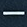

# Teclas del DistoX
A continuación se hace una referencia rápida de las teclas del DistoX que vamos a usar en esta guía. En algunos casos se podrá encontrar más adelante una descripción de las funciones con mayor detalle.

|Tecla|Función|
|---|---|
|  | Enciende el Disto / Enciende el puntero láser / Realiza la medición |
| |Cancela la operación / Apaga el láser / Si la mantenemos pulsada apaga el Disto|
| |Estado del dispositivo: nivel de carga de las pilas, versiones de hardware y firmware instaladas, nivel de iluminación de la pantalla. Se sale de esta pantalla con  |
|  | Configura el disparo retardado en el tiempo. Esto puede ser útil para realizar tomas más precisas al evitar la vibración del dedo cuando se ejecuta la medición|
  
Las siguientes combinaciones de teclas deben mantenerse pulsadas **durante 2 segundos** hasta que suene un pitido y se active la función.

|Combinación&nbsp;de&nbsp;teclas|Función|
|---|---|
|  | Apaga el Disto |
|  +  | Activa / desactiva el [modo silencioso](#ModoSilencioso) |
|  +  | Apaga / enciende el sonido. Por ejemplo el pitido que se escucha cuando se hace una medición o se encienden y apagan funciones del dispositivo. |
|  +  | Enciende / apaga la iluminación de la pantalla. Se desaconseja totalmente mantener la pantalla iluminada por el importante gasto de pilas que supone |
|  +  | Cambia la medición de rumbo entre grados sexagesimales (0 - 360) y grados centesimales (0 - 400) |
|  +  | Activa / desactiva la medición inversa (como si se estuviese haciendo la toma desde el destino hacia el origen |
|   +  | Limpiar la memoria de mediciones no enviadas. Ver [mediciones pendientes de enviar](#medicionesNoEnviadas)  |
|  +  | Encender / apagar [Bluetooth](#BlueTooth) |
|  +  | Bloquear el Disto para impedir que se encienda con una simple pulsación de la tecla . Esto puede ser útil para evitar gasto de la batería si se lleva el Disto en una saca con la posibilidad de que se pulse la tecla de encendido |
|  +  | Activar / desactivar el [modo triple-disparo](#fnModoTripleDisparo) |

