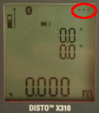

## Pantalla del DistoX
  
Elementos que debemos tener en cuenta en la pantalla de nuestro DistoX.

###  Punto de referencia de medición
El **punto de referencia de medición** es la parte del Disto desde la que el aparato mide la distancia. La que nos interesará generalmente es la parte trasera (las más cercada al botón , pero también hay posibilidad de medir desde la parte delantera (la más cercana a la pantalla) o desde el trípode en caso de que lo fijemos sobre uno para facilitar las mediciones. La información del punto de referencia se muestra en la parte superior izquierda y según la variemos cambiará el icono en la pantalla.

 Para cambiar el valor pulsaremos las tecla , lo que hará que varíe entre posición trasera, posición delantera y trípode, hasta que el icono en pantalla muestre el valor deseado.
 
 **Nota**: hay que tener en cuenta que, al menos en la versión actual, después de cada encendido siempre se coloca en la opción por defecto, que es la de la parte trasera.

###  Bluetooth
En la parte superior deberíamos ver el icono de Bluetooth, lo que indica que la comunicación entre DistoX y el móvil o tablet va a poder establecerse.

Para activar / desactivar Bluetooth pulsaremos al mismo tiempo las teclas  y  durante unos 2 segundos hasta que suene un pitido y veamos aparecer / desaparecer el icono en pantalla.

### Modo silencioso
Si en la parte superior derecha del Disto observamos 3 puntos, tal como se muestra a continuación 

 

significa que lo tenemos configurado en **modo silencioso**. Esto no tiene que ver con el sonido del aparato, sino con que en este modo las tomas de medición se almacenan en la memoria pero no se enviarán a TopoDroid. Esta es una condición **no deseada**; la indicamos aquí para prevenir errores o que pensemos que el Disto se ha estropeado.
Para activar / desactivar el modo silencioso pulsaremos al mismo tiempo las teclas  y  durante unos 2 segundos hasta que suene un pitido y veamos aparecer / desaparecer los 3 puntos en pantalla.

###  Mediciones pendientes de enviar al dispositivo
En modo de funcionamiento normal, es decir, si no estamos en [modo silencioso](#ModoSilencioso), la parte superior derecha indica la cantidad de mediciones que están pendientes de enviar al dispositivo con TopoDroid. Si está en blanco significa que no hay nada pendiente. En la siguiente imagen vemos que hay 6 mediciones pendientes de enviar a TopoDroid. Más adelante veremos cómo es la transmisión de datos entre DistoX y TopoDroid.

 

### Carga de las pilas
En la parte superior central se representa la carga de las pilas, tal como se ve en la imagen adjunta. Recordamos la necesidad de calibrar el DistoX después de reemplazar las pilas.

### Rumbo e inclinación
Los dos valores de la zona central de la pantalla son el rumbo o azimut (valor superior) e inclinación (valor inferior). En caso de que estemos midiendo en grados sexagesimales, que es la opción de fábrica, el rumbo tendrá valores entre 0 y 360 grados. La inclinación varía entre 90º cuando el Disto está en vertical apuntando hacia arriba y -90º cuando el Disto está en vertical apuntando hacia abajo. Según la imagen adjunta, el rumbo es de 71,8º y la inclinación de 23º.

### Distancia al objeto marcado por el puntero
Cada vez que el Disto hace una medición, muestra en la parte inferior de la pantalla la distancia al objeto seleccionado. Hay que tener en cuenta que mientras el puntero láser está encendido no indica la distancia y en esa parte de la pantalla aparecerán 3 rayas horizontales. El valor de distancia tras la última medición, según se muestra en la pantalla adjunta, es de 4,345 metros.

 