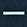

# Configuración de DistoX
El primer requisito para utilizar el DistoX con garantías es tenerlo calibrado. Se recomienda hacerlo al menos después de un cambio de pilas, cuando se actualiza el firmware o cada cierto tiempo. Se ha comprobado que incluso una ligera rotación interna de las pilas en el zócalo del DistoX afecta a la brújula. Por eso lo recomendable sería intentar fijarlas y hacer una calibración antes de cada sesión de topografía (es un proceso que lleva unos 10 minutos).

Hay varios manuales en los que se detalla esta operación; aquí veremos la calibración desde la aplicación TopoDroid.

##  Medición con retardo
El Disto ofrece la posibilidad de hacer mediciones más precisas eliminando el efecto de vibración de la mano cuando pulsamos la tecla de disparo. Esto se consigue con el disparo retardado. Veamos como se configura:

### Configuración del tiempo de retardo

Con el Disto encendido pulsamos  para asegurarnos de que el láser está apagado. A continuación pulsamos  y en la parte inferior de la pantalla veremos el tiempo de retardo configurado, que por defecto es de 5 segundos. Para cambiar este valor usaremos las teclas  y . Aconsejamos pulsar dos veces la tecla  para reducirlo a 3 segundos, que es un valor suficiente. Pulsamos  para salir de la configuración.

### Efectuar disparos con retardo

Si ahora queremos hacer una medición con retardo encendemos el puntero láser (pulsando ) y en vez de disparar pulsando de nuevo  en este caso pulsamos . Ahora se iniciará la cuenta atrás, emitiendo un pitido por segundo, durante la que tendremos que mantener el puntero en el objetivo. Sabremos que se ha hecho la medición cuando se apaga el puntero al final de la cuenta atrás.

## Modo triple disparo
Este modo tiene ciertas ventajas para facilitar el trabajo y hacerlo más preciso. A continuación daremos los detalles.
Sabremos que está activado si vemos un triángulo en la parte inferior izquierda de la pantalla del Disto.

Para activar / desactivar este modo pulsaremos al mismo tiempo las teclas  y  durante unos 2 segundos hasta que oigamos un pitido y veamos aparecer / desaparecer el triángulo en la pantalla.
### ¿Que implica el modo de triple-disparo?
En este modo, la mediciones radiales se hacen con una sola toma, como es habitual. Pero la visual a la siguiente estación deberemos hacerla con 3 disparos consecutivos que deben ser lo más parecidos posible, es decir, midiendo desde el mismo punto hacia el mismo objetivo los 3 disparos. De esta forma, si el Disto detecta que hacemos 3 tomas consecutivas que tienen entre ellas una diferencia de distancia menor de 5 cm y una diferencia de ángulos menor de 2º, entonces asume que esas 3 tomas corresponden a un cambio de estación y en ese caso hará un doble pitido y mostrará en la zona derecha de la pantalla 3 líneas verticales tal como se muestra en la siguiente imagen 

Este sistema sirve para asegurarnos de que la medición entre estaciones tiene la suficiente precisión, ya que si al realizar el tercer disparo no hace el doble pitido ni muestra las 3 líneas verticales eso quiere decir que la toma no ha sido correcta y deberemos descartarla, teniendo que volver a realizar los 3 disparos consecutivos desde la estación actual a la siguiente.

Otra consecuencia derivada de un triple disparo correcto es que, a continuación, la estación activa pasará a ser automáticamente aquella a la que hemos hecho el disparo. De esta forma nos facilita la labor ya que no tenemos que cambiar nosotros a mano la estación activa. Todo esto lo veremos más adelante cuando expliquemos el método de trabajo.
  
  
