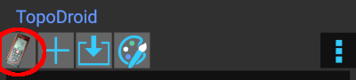
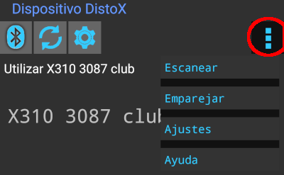
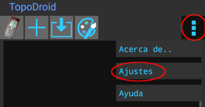
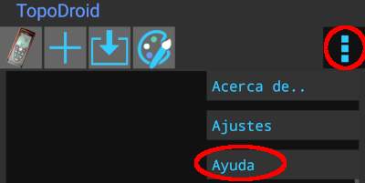
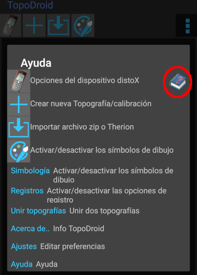

# Configuración de TopoDroid

## Emparejar por Bluetooth con DistoX
Es imprescindible la conexión Bluetooth entre TopoDroid y DistoX, ya que es el canal por el que se transfieren los datos. El emparejamiento se puede hacer desde el menú [**Ajustes**] de Android o desde el menú DistoX de TopoDroid. En cualquier caso la contraseña de emparejamiento es 0000.

Desde la pantalla principal pulsamos el icono DistoX (el primero de la izquierda) 

En la siguiente pantalla pulsamos el botón **3puntos** (a la derecha) para que se despliegue el menú de **escanear** y **emparejar** dispositivos Bluetooth 

Una vez emparejado no hará falta que volvamos a este menú cada vez. Si el Bluetooth está encendido, se restablecerá la conexión automáticamente al usar TopoDroid.

## Ajustes recomendados de TopoDroid

Para acceder a los ajustes generales, desde la pantalla principal pulsamos **3puntos** > Ajustes  para que se abra el panel de ajustes generales

### Nivel de la interfaz de usuario

TopoDroid da la posibilidad de trabajar con niveles de usuario desde **Básico** hasta 
**Experto**. El nivel **Básico** es el que viene por defecto y no permite todas las opciones que vamos a utilizar en este manual, así que dentro del panel de ajustes que acabamos de abrir entraremos en la opción **Nivel de usuario** y lo cambiaremos a **Experto**. La razón es que solamente en modo **Experto** se permiten hacer secciones transversales en una estación; una función que veremos más adelante. En cualquier caso, en nuestra opinión es mejor tener todas las funciones disponibles e ir usándolas según vayamos aprendiendo.

## Ayuda de TopoDroid

En el menú **3puntos** que hay en la parte superior derecha de cada pantalla de TopoDroid, podemos encontrar una opción **Ayuda**, que nos despliega información que puede ser útil.

Si pulsamos sobre el **libro** (señalado en rojo) detallará un poco más la información. 

      
       