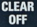

# Flujo de trabajo para realizar una topografía
Hay varios métodos posibles para topografiar. Vamos a centrarnos en uno de ellos y examinaremos las ventajas que tiene para trabajar de forma más eficiente.

Se basa en hacer las mediciones con cierto orden y en cumplir ciertos requisitos. Lo que se propone es que, al llegar a cada [estación](#fnEstacion) se tomarán en primer lugar las radiales y la última medida que se tomará será hacia la siguiente estación.

En este método de trabajo se propone configurar el DistoX en [modo triple-disparo](#fnModoTripleDisparo) para distinguir una medición radial de una visual entre estaciones.

Después de haber configurado DistoX y TopoDroid según hemos indicado en la parte previa de este documento, procederemos a indicar cómo realizar nuestra primera topografía.

## Nueva topografía

Para crear una nueva topografía, en la pantalla principal pulsamos el botón  y nos aparece el formulario de datos 

El primer dato a cubrir es el nombre de la cavidad. Si la fecha de la topo es distinta a la actual, pulsaremos en la fecha para cambiarla. A continuación cubriremos el nombre del autor o autores de la topo. El siguiente campo es el nombre de la primera estación. Con esos datos cubiertos ya podemos pulsar **Abrir** para que guarde la topo y la abra en la aplicación.
Después de pulsar **Abrir** deberíamos ver la pantalla de topografía de TopoDroid, cuyo encabezado tiene este aspecto 

## Ajustar el modo de visualización

Recomendamos al principio ver todas las mediciones tomadas incluyendo la numeración de las tomas. Para ello pulsaremos el botón  y marcaremos todas las opciones. Posteriormente, al finalizar este manual, el usuario puede cambiar estos ajustes.

## Toma de datos en DistoX

Tal como hemos indicado el sistema implícito de trabajo es, por cada estación, medir primero las radiales y finalmente hacer la medición a la siguiente estación. En este punto se supone que estamos en la primera estación (numerada como **0** o como le hayamos indicado en el formulario de **Nueva cavidad**)
Si hemos estado haciendo mediciones de prueba con el Disto, en la parte superior derecha veremos el número de tomas realizadas. En este momento debemos limpiar esa memoria. Tal como se ha [indicado anteriormente](#combinaciones2segundos), la combinación de teclas es  +  durante 2 segundos. Ahora deberíamos ver en blanco la parte superior derecha.
Siguiendo un caso hipotético tomaremos 3 radiales con nuestro DistoX. Al terminar veremos en el Disto una pantalla parecida a esta, en la que vemos los datos de la última medición, pero lo importante es que en la parte superior derecha tenemos el número de datos pendientes de enviar a TopoDroid. En este caso 3  

### Descargar datos de DistoX a TopoDroid

Para descargar datos pulsamos el botón  y se realizará la transferencia, con lo que en nuestra pantalla veremos algo así 

El aspecto puede variar dependiendo del tamaño de la pantalla y ajustes como el tamaño del texto. Los 6 datos que vemos aquí son:
1. El número de toma (la secuencia de orden en que se ha tomado cada punto)
1. La estación desde la que se ha tomado el punto. En este caso todos se han tomado desde la estación 0
1. La distancia, rumbo e inclinación al punto objetivo
1. Entre corchetes indica la referencia con respecto a la dirección (izquierda, derecha o vertical)
   
