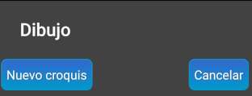

## Visualizar el croquis

Para ir a la parte gráfica pulsaremos  y la primera vez nos aparecerá la pantalla 

Pulsaremos [Nuevo croquis] y veremos

en donde nos piden un nombre para el croquis (por defecto 1) y el número de la estación en la que se basa. Esto se hace porque, según la complejidad de la cavidad, podría ser conveniente tener un croquis distinto por cada estación. Si la cavidad no tiene demasiado desarrollo podría bastar con un solo croquis para representarla en su totalidad.

De ahora en adelante, cada vez que volvamos a pulsar  para ir a la parte gráfica, tendremos opción de seleccionar alguna de las plantas o alzados ya creados o volver a pulsar **[Nuevo croquis]** si queremos crear un croquis basado en otra estación.

Al pulsar **[Ok]** llegaremos a ver el croquis 

Según el caso, podríamos querer cambiar el tamaño del texto de la estación o el grosor de la línea. Iremos, en la parte superior derecha del menú, a **3Puntos** &gt; **Ajustes** &gt; **Ajustes de pantalla de croquis** y ahí tenemos, entre otras, las opciones **Grosor de la línea de topografía** y **Tamaño de la etiqueta de la estación**.

En el menú de dibujo también tenemos el botón  para indicar qué elementos queremos ver/ocultar

## Edición en la pantalla de dibujo

Hay 3 acciones principales que se pueden hacer en la pantalla de dibujo, que se corresponden con los 3 primeros iconos (en verde) del menú de dibujo

* Dibujar 
* Borrar 
* Editar  (modificar las propiedades de los elementos ya dibujados)

Activamos alguna de estas 3 actividades pulsando sobre su botón correspondiente y sabremos que está activa porque tiene un color más vivo que las otras dos restantes.

Si está activa alguna de estas 3 acciones y lo que queremos es desplazarnos o hacer zoom en el dibujo tenemos 2 opciones

  * Desplazar el croquis por la pantalla usando 2 dedos a la vez
  * Pulsar sobre la acción activa de forma que las 3 acciones queden desactivadas (las 3 en color verde pálido) y ya podremos desplazar el dibujo arrastrando con un solo dedo

### Acción de dibujar 
Tenemos 3 tipos de elementos para dibujar: puntos, líneas y áreas. Previamente recomendamos ir al menú **3Puntos** &gt; **Simbología** para marcar y desmarcar elementos dentro de estas 3 categorías de forma que queden activos solamente aquellos que estimamos que vamos a utilizar.

Al pulsar el botón de dibujar, este se pondrá de un color verde luminoso y en la parte superior de la pantalla mostrará el tipo de elemento activo para dibujar. En la pantalla de ejemplo, el elemento activo es [**Línea Pared**] 

Si queremos dibujar un elemento distinto pulsaremos  para que se nos abra la ventana de selección. Tener en cuenta que en el caso de elementos puntuales, además del propio símbolo (por ejemplo, corriente de aire) se puede seleccionar su tamaño y en algunos casos la dirección en la que apunta.

Para opciones relacionadas con elementos puntuales iremos a **3Puntos** > **Ajustes** > **Ajustes de puntos** y ahí nos encontraremos
* **Símbolos de punto sin zoom**: si está marcado, el tamaño del símbolo sigue siendo el mismo aunque varíe el zoom en la pantalla de dibujo
* **Tamaño de los símbolos**
* **Tamaño del texto**: se emplea al dibujar **textos**, que son uno de los elementos puntuales disponibles

Para opciones relacionadas con elementos lineales iremos a **3Puntos** &gt; **Ajustes** &gt; **Ajustes de línea** y de entre las opciones disponibles tenemos la del **Grosor de la línea**.

Al igual que en muchas otras aplicaciones, también tenemos los botones deshacer y rehacer  para dar marcha atrás o volver hacia adelante en las últimas acciones realizadas.

### Acción de borrado  
En la acción de borrar tenemos 2 nuevos botones
*  Al pulsarlo nos muestra la siguiente lista . Según lo que marquemos cambiará el icono en pantalla y actuará como filtro, de forma que si por ejemplo seleccionamos **Borrar puntos**, cuando pasemos el dedo por encima de líneas o áreas, éstas no se borrarán.
* : radio de acción del borrado. Cada vez que lo pulsemos cambiará el icono entre 3 posiciones: desde un radio más pequeño (más precisión) hasta un radio más grande.</li>
</ul>

### Acción de editar 
Esta opción sirve para modificar ciertos aspectos de los elementos ya dibujados. Por ejemplo desplazar un vértice de alguna línea / área o cambiar el tamaño / orientación de elementos puntuales. En esta acción primero seleccionamos el elemento a editar y luego podemos pulsar el botón  que nos mostrará un panel con las propiedades que podemos modificar.

