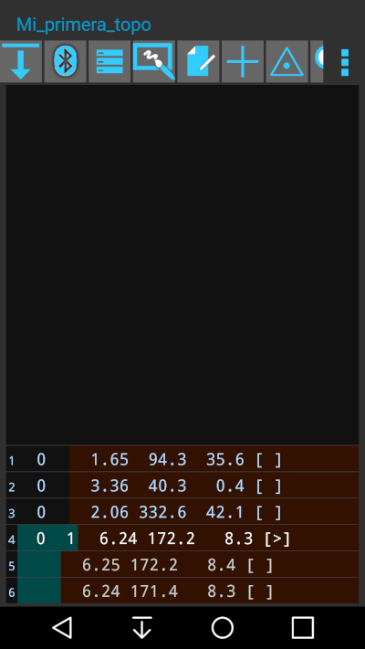
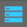

## Cambio de estación base
Recapitulando, hasta ahora hemos tomado 3 radiales con el DistoX 3 desde la estación inicial (en este caso estación 0). Ahora vamos a cambiar de estación base. Para ello ya hemos comentado anteriormente que debemos [configurar el DistoX en modo triple-disparo](#fnModoTripleDisparo) y cómo debemos [realizar el triple-disparo](#DescripcionTripleDisparo) para hacer la visual a la siguiente estación.
Por tanto realizaremos un triple disparo entre la estación actual y la siguiente. Si no lo conseguimos, aconsejamos [borrar la memoria de mediciones pendientes](#BorrarPuntosNoEnviados) de enviar tal como también hemos explicado. De esta forma evitamos pasar a TopoDroid mediciones inválidas que pueden confundirnos. Recordamos que para facilitar una medición precisa puede ser útil el disparo retardado con [Timer](#fnConRetardo), que ya hemos visto.
Si estamos en la pantalla de dibujo volveremos atrás a la pantalla de lista de mediciones y allí pulsamos otra vez el botón  para descargar lo pendiente, que en este caso será el triple disparo del cambio de estación. Una vez que termina el volcado la lista de mediciones será algo parecido a:

En la línea 4 vemos que automáticamente, al haber hecho un triple disparo, lo ha interpretado como una visual desde la estación 0 a la estación 1. Las líneas 5 y 6 son parte del triple disparo (vemos que sus valores son muy parecidos al primer disparo de la línea 4). Como son valores redundantes no tienen número de estación, ni de partida ni de llegada. Realmente no es muy útil visualizar las líneas 5 y 6. Podemos ocultarlas pulsando  y desmarcando la línea **Visualizar tomas repetidas**.

Como consecuencia del triple disparo ahora la estación activa es la 1. Por tanto nos desplazaremos con el **Disto** a la estación 1 para hacer las radiales desde ahí.
Y así continuaría el bucle de trabajo, que básicamente consiste en hacer mediciones con Disto, pasarlas a TopoDroid, comprobar que han llegado en la pantalla de mediciones de **TopoDroid** y pasar a la pantalla de **croquis** para complementar la topo con elementos gráficos: puntos, líneas, áreas.

