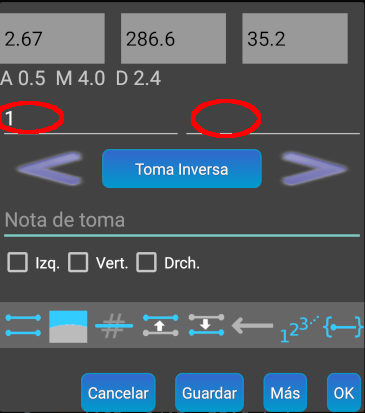

## Casos en los que se rompe el bucle de trabajo

Imaginemos que estamos tomando las radiales de la estación 1 y en ese momento nos damos cuenta de que nos falta una radial de la estación 0 ¿Cómo solucionarlo?

### Cambiar datos de una medición

La solución que proponemos es ir a la estación **0**, hacer la medición y transferirla a TopoDroid. Una vez que la veamos en la lista de mediciones pulsaremos en esa línea **encima de la longitud o el rumbo** y se abrirá el panel de edición de la toma 

De este panel, lo que nos interesa ahora son las zonas marcadas con círculos rojos, que corresponden a la estación origen y la estación destino. En este caso, como es una radial, solo tiene estación origen y la estación destino está vacía. En la estación origen vemos el valor 1. Cambiaremos ese 1 por un 0, pulsamos **[Ok]** y habremos arreglado el problema, ya que comprobaremos en la lista de mediciones que esa medición ahora aparece realizada desde la estación **0**.

### Cierre de poligonal

La solución anterior también es útil en el cierre de una poligonal. Imaginemos que establecemos una poligonal con las estaciones 4, 5, 6, 7 y 8. Para finalizar haremos un triple disparo desde la 8 hacia la 4 para cerrarla. Pero como el triple disparo lo que hace automáticamente es incrementar el número de estación, al volcar a TopoDroid veremos que la visual se ha establecido desde la 8 hacia la 9. Editaremos ese punto tal como hicimos en el caso anterior y cambiaremos el 9 por el 4 para cerrar la poligonal.

