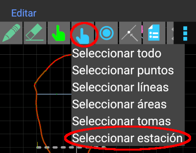
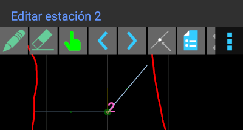
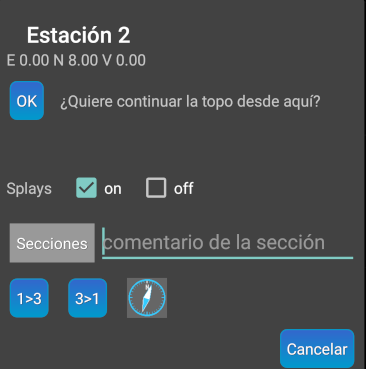
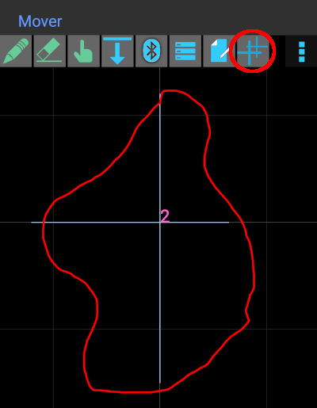
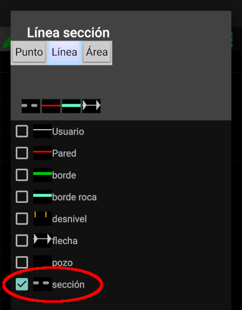
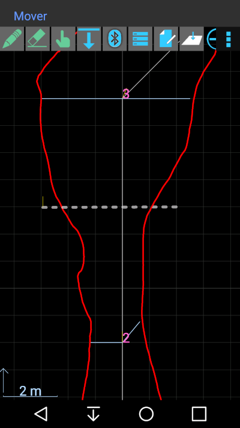
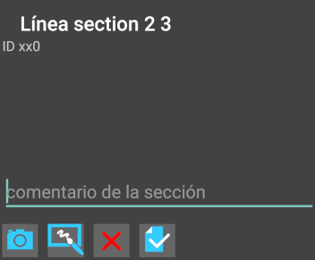

## Secciones transversales

En TopoDroid podemos realizar 2 tipos de secciones transversales 
* Situada en una estación
* Situada en cualquier tramo de la galería
  
### Sección transversal en una estación
Si queremos aportar a la topo un croquis de sección transversal situado exactamente en una estación, esto se hace desde la ventana de croquis de la planta. Ahí nos pondremos en **modo edición** (pulsando el botón ). Para facilitar la selección de la estación podemos filtrar de forma que solo se puedan seleccionar estaciones. Para ello haremos como mostramos en la siguiente pantalla 

A continuación seleccionaremos la estación sobre la que queremos realizar la sección. En nuestro ejemplo hemos marcado la estación **2**. Sabremos que está seleccionada porque hay un pequeño punto brillante en la esquina inferior izquierda del nombre de la estación y en la parte superior de la aplicación aparece el texto **Editar estación 2** 

El siguiente paso es pulsar el botón de **Propiedades** . En el caso de una estación, si tenemos los ajustes de TopoDroid que hemos recomendado a lo largo de esta guía, veremos algo como esto 

Los botones **1&gt;3** y **3&gt;1** son para seleccionar si la sección que queremos dibujar está orientada en dirección **estación 1 a estación 3** o **estación 3 a estación 1**. En este caso escogeremos **1&gt;3** y se abrirá la ventana de croquis de la sección 

En la ventana precedente hemos destacado el último botón de la derecha, que sirve para mostrar/ocultar las radiales trazadas desde la estación. El hacerlas visibles generalmente nos ayudará a dibujar la sección. La cuadrícula de fondo, con cuadrados de 1 metro de lado, también nos puede ayudar con las dimensiones de nuestro croquis.

### Sección transversal en un tramo de la galería
Para trazar la sección de un punto cualquiera de la galería tenemos que dibujar un tipo de línea especial llamado **sección**

Podemos ver en la siguiente pantalla una línea de sección trazada en la galería entre las estaciones 2 y 3

Inmediatamente después de trazar la línea de sección nos aparece la ventana de propiedades 

pulsaremos el icono de **croquis**  para dibujar la sección.
Tener en cuenta que en este caso el botón  sirve para alternar entre mostrar las radiales de la estación precedente, de la estación siguiente, mostrar ambas y ocultar ambas.
Si queremos ver o modificar la sección transversal posteriormente, tendremos que pasar al modo **editar** , seleccionar la **línea de sección** y pulsar el botón **propiedades** . En esa ventana pulsaremos el botón de **croquis** , como ya hicimos cuando creamos la línea de sección.

