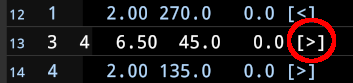
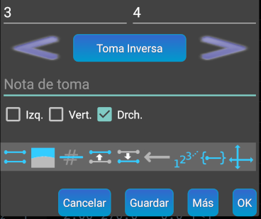

## Croquis de alzado desarrollado
Antes de poder croquizar el alzado desarrollado debemos tener en cuenta que todas las visuales de estaciones tengan asignado correctamente el valor de **extensión**. Ese valor nos indica la posición relativa entre ambas estaciones. Por poner un ejemplo sencillo, si en el alzado desarrollado la estación que queremos ver más a la izquierda es la **1** y la que queremos ver más a la derecha es la **3**, entonces la visual 1-2 debería tener la extensión **[&gt;]** y la visual 2-3 debería tener también la extensión **[&gt;]** (El valor **[&gt;]** significa que la segunda estación está más a la **derecha** que la primera. El valor **[&lt;]** significa que la segunda estación está más a la **izquierda** que la primera)

Como ejemplo, en la pantalla siguiente vemos que la visual de la estación 3 a la 4 tiene extensión **derecha**

Para modificar la extensión seleccionamos esa visual **encima de la longitud o el rumbo** y se abrirá la ventana de edición:

Vemos que está marcado el valor **Drch**. Si queremos cambiarlo a **extensión izquierda** marcaríamos la casilla **Izq.** y pulsaríamos el botón **[Ok]**. Esto tendría como consecuencia que en el croquis de alzado desarrollado la estación **4** aparecería a la izquierda de la estación **3**.
Como conclusión, la norma que debemos recordar es que, para que aparezcan en el croquis de alzado desarrollado, todas las visuales entre estaciones deben tener un valor de **extensión**, sea **[&gt;]** o **[&lt;]**, ya que si hay visuales sin **extensión**, esas estaciones no serán visibles en el croquis.

Podemos pasar rápidamente de la planta al alzado y viceversa usando los botones  y  que veremos en la parte superior derecha de los croquis de planta y alzado.

