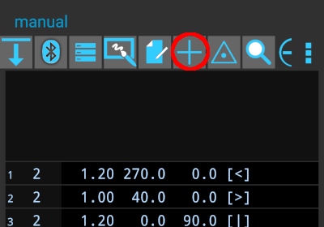
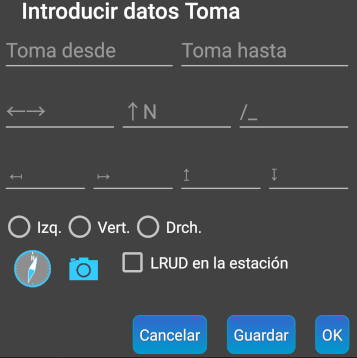

## Introducción manual de mediciones

Hasta ahora, a lo largo de esta guía, hemos introducido datos en TopoDroid mediante las mediciones realizadas con nuestro DistoX. Quizá interese saber que también podemos introducir mediciones de forma manual directamente en TopoDroid. Una de las razones para hacerlo podría ser aprender a utilizar la aplicación cuando no tenemos el Disto a mano o para introducir valores específicos.
Para hacerlo pulsamos el botón **[+]** en la lista de mediciones

En la ventana que se abre a continuación podemos introducir la estación desde, estación hasta. En la segunda fila la distancia, rumbo e inclinación. En la tercera fila incluso podemos indicar la distancia a nuestra izquierda, derecha, encima y debajo:

 

Al pulsar **[Ok]** esa medición se visualizará en la lista de mediciones.

