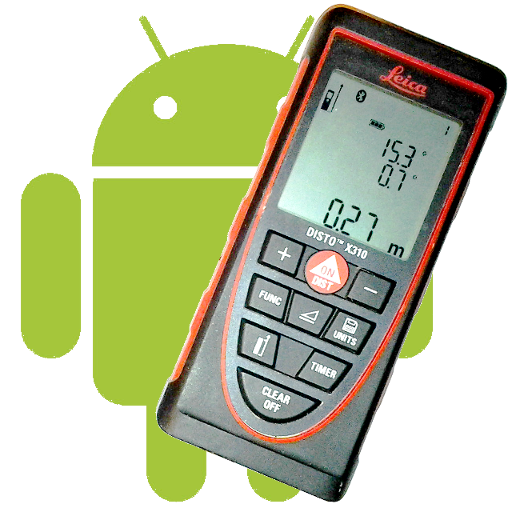

# DistoX + TopoDroid

Este es un pequeño documento en el que intentaremos dar una idea general tanto del dispositivo **DistoX** como de la aplicación **TopoDroid** y mostrar un esquema de funcionamiento para elaborar topografías utilizándolos conjuntamente.

No es, ni pretende ser, un manual exhaustivo. Para conocer a fondo las posibilidades tanto del DistoX como de TopoDroid recomendamos acudir a guías de referencia.

Sí se aconseja **leer de principio a fin todo este documento, sin saltarse contenido**, para tener los ajustes recomendados y que sea más fácil seguir el desarrollo de la guía. Posteriormente el usuario podrá realizar los cambios que considere.

> Luis Iglesias - Espeleoclub Aradelas - Vigo